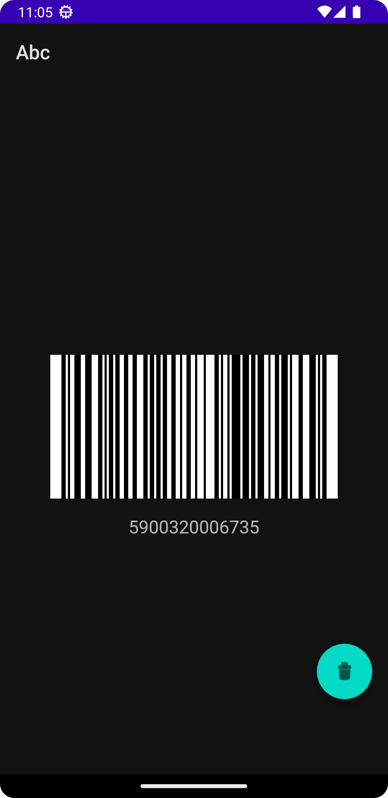
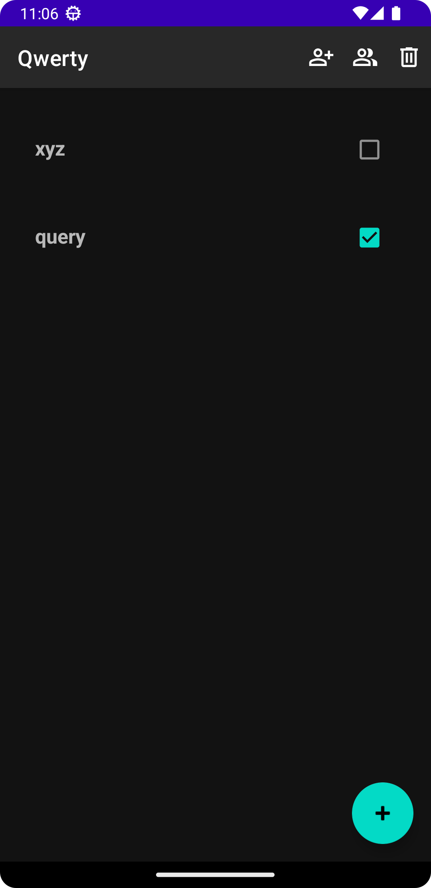
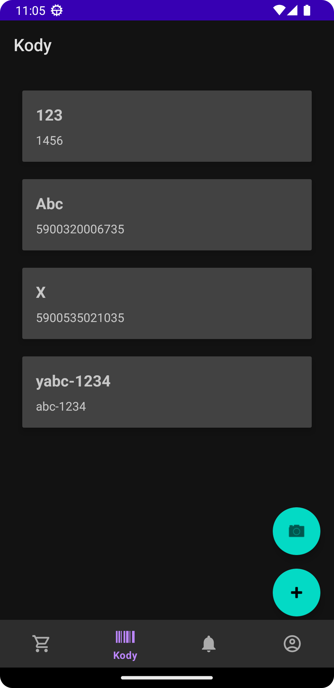
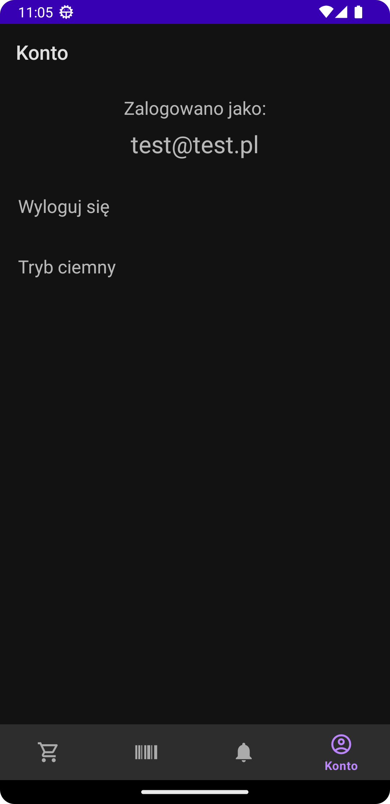
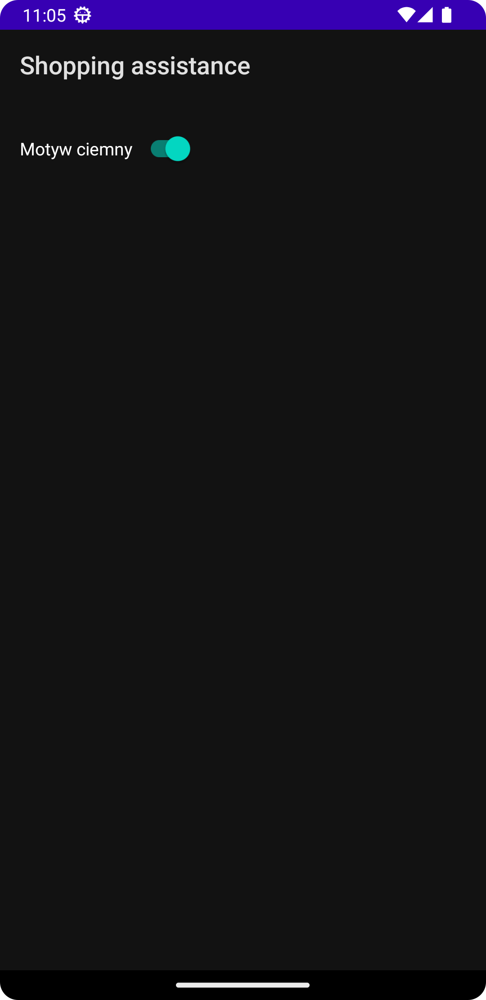

# Project Name
> Shopping Assistance

## Table of Contents
* [General Info](#general-information)
* [Technologies Used](#technologies-used)
* [Features](#features)
* [Screenshots](#screenshots)
* [Project Status](#project-status)
* [Room for Improvement](#room-for-improvement)
* [Contact](#contact)
<!-- * [License](#license) -->

## General Information
> This application is a shopping list manager designed to help users organize and keep track of their shopping needs. It allows users to create multiple shopping lists, add and remove items from these lists, and mark items as purchased.
> The app provides features such as barcode scanning for easy addition of codes used by people in various shops and customization options for theme selection.
> Additionally, it offers seamless synchronization across devices using Firebase Firestore, ensuring users have access to their lists wherever they go.
<!-- You don't have to answer all the questions - just the ones relevant to your project. -->

## Technologies Used
- Kotlin
- Firebase Firestore
- Firebase Authentication

## Features
- Managing shopping lists
- Adding users into the list so others can see and help you do the shopping
- Adding/scanning codes from cards from various shops so you can have them all within one app
- Changing the theme mode to dark/light

## Screenshots

<!-- If you have screenshots you'd like to share, include them here. -->

## Project Status
Project is: _in progress_

## Room for Improvement
Include areas you believe need improvement / could be improved. Also add TODOs for future development.

Room for improvement:
- Changing the type of added barcode, because some shops use other format than the one used now in my app. Maybe choosing a specific store from the list and then the code would be created with a specified format.

To do:
- Add notifications while new product is added to the list by another user
- Tests

## Contact
Created by [krzysztofb200](https://github.com/krzysztofb200) - feel free to contact me!

<!-- Optional -->
<!-- ## License -->
<!-- This project is open source and available under the [... License](). -->

<!-- You don't have to include all sections - just the one's relevant to your project -->
